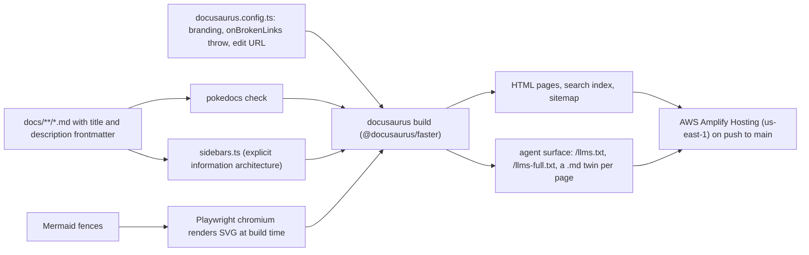

# Vegan Grove Docs

**Public documentation for a private membership: 74 pages, 13 ADRs, an explicit sidebar, and an agent surface generated from the same source.**

[](https://github.com/wbaxterh/vegan-grove-docs/actions/workflows/ci.yml)     [](./LICENSE) [](https://docs.vegangrove.org) 

Vegan Grove is a privacy-first vegan community and activism platform for Southern California. This repository is the documentation site at `docs.vegangrove.org`: the product vision, the privacy promise with its data inventory and threat model, the architecture and its ADRs, one section per code repository, feature PRDs, engineering conventions, deployment runbooks, and the roadmap. It is built with PokeDocs, a Docusaurus preset with build-time Mermaid, one-block branding, and an agent surface, and it is public on purpose so anyone can audit how member data is handled.

## Part of Vegan Grove

| Repository | Role | Stack | Deploys to |
|---|---|---|---|
| [vegan-grove-api](https://github.com/wbaxterh/vegan-grove-api) | REST API, Socket.IO, workers, the only reader of the database | Express 5, Mongoose 9, zod, pino, Socket.IO, vitest | One EC2 instance, PM2 behind nginx, `us-east-1` |
| [vegan-grove-web](https://github.com/wbaxterh/vegan-grove-web) | Public site and the `/app` member area | Next.js 15, Tailwind 4, shadcn/ui, MapLibre GL | AWS Amplify Hosting, `us-east-1`, on push to `main` |
| [vegan-grove-mobile](https://github.com/wbaxterh/vegan-grove-mobile) | iOS and Android app | Expo SDK 57, expo-router, TanStack Query, MapLibre | EAS Build, App Store and Play |
| [vegan-grove-docs](https://github.com/wbaxterh/vegan-grove-docs) (this repo) | Product, privacy, and architecture docs | PokeDocs on Docusaurus 3 | AWS Amplify Hosting, `us-east-1`, on push to `main` |

Docs: [docs.vegangrove.org](https://docs.vegangrove.org). Product: [vegangrove.org](https://vegangrove.org). Both domains and `api.vegangrove.org` are launching.

## Architecture

Markdown in, three outputs out. Every page declares a `title` and a one-sentence `description`, `sidebars.ts` decides what appears and in what order, Mermaid fences become SVG in a headless chromium during the build, and the same pages produce the HTML site and the agent surface.



The build is strict on purpose. `onBrokenLinks: 'throw'` and `onBrokenMarkdownLinks: 'throw'` fail on any dead link, `pokedocs check` fails on a page without a `description` or outside the sidebar, and a Mermaid block that does not render fails the build rather than shipping a blank figure. The color theme (the whole Infima ladder, light and dark) is compiled from the two `brandColor` values in `docusaurus.config.ts`; `src/css/custom.css` carries personality only and never hand-writes `--ifm-color-primary`.

## Quick start

```bash
nvm use                           # Node 24, from .nvmrc
npm ci
npx playwright install chromium   # once: Mermaid renders through chromium at build time
npm run start                     # live dev server, http://localhost:3000, no Mermaid prerender
npm run validate                  # biome check, tsc, pokedocs check, docusaurus build
```

`validate` is exactly what CI runs on every pull request, alongside a gitleaks scan of the full history. Husky runs Biome on staged code and `secretlint` on every staged file.

## Scripts

| Script | What it does |
|---|---|
| `npm run start` | `docusaurus start`, the dev server with hot reload |
| `npm run build` | `docusaurus build` into `build/`, with Mermaid prerendered |
| `npm run serve` | serves `build/` to check the production output |
| `npm run clear` | clears the Docusaurus cache when a build behaves strangely |
| `npm run docusaurus` | the raw CLI for anything else |
| `npm run typecheck` | `tsc` over the config, sidebar, and landing page |
| `npm run lint` | `biome check .` |
| `npm run lint:fix` | `biome check --write .` |
| `npm run check` | `pokedocs check`: lints the docs for what a green build wants (frontmatter, sidebar coverage) |
| `npm run validate` | lint, typecheck, check, build: the CI contract and the PR gate |
| `npm run prepare` | installs the husky hooks |

## Configuration

There is no `.env.example` because the site needs no secrets. Three build-time variables are read by `docusaurus.config.ts`:

| Variable | Purpose | Shape |
|---|---|---|
| `POKEDOCS_URL` | Overrides the site `url` for a preview or staging build | origin, default `https://docs.vegangrove.org` |
| `POKEDOCS_BASE_URL` | Overrides `baseUrl` when the site is served under a path | path with slashes, default `/` |
| `POKEDOCS_STRICT_URL` | Turns a placeholder `url` in a production build from a warning into an error, so a misconfigured environment cannot publish a sitemap pointing at the wrong origin | `true` in the deploy build |

## Project layout

```
docs/
  intro.md               the front door
  product/               vision, principles, concept map, personas
  privacy/               index (the promise), data inventory, threat model, disclosure policy
  architecture/          overview, repo dependency map, tech stack, data model, auth, adrs/ (13 ADRs plus index)
  backend/ web/ mobile/  one folder per code repository: overview first, then what the sidebar lists
  features/              overview, then one page or folder per feature (places and events have folders)
  engineering/           workflow, linting, testing, pre-commit hooks, errors, logging, agent guide
  deployment/            index, backend, web app, mobile, docs, cost sheet
  roadmap/ releases/     milestones, open questions, release notes
src/
  css/custom.css         site personality only; the color ladder is compiled from branding
  pages/index.tsx        landing page driven by customFields.landing in the config
static/                  logo, favicon, robots.txt, CNAME
sidebars.ts              the information architecture; a page not listed here does not appear
docusaurus.config.ts     branding, strict links, edit URL, navbar, footer, landing cards
.github/                 CODEOWNERS, PR template, dependabot, workflows (ci.yml is the gate)
```

## What works today

- 74 pages across eleven sidebar sections: Product, Privacy, Architecture (with 13 ADRs), Backend, Mobile, Web, Features, Engineering, Deployment, Roadmap, Releases. Every page has a `description`; `validate` is green on a fresh clone.
- Mermaid rendered to SVG at build time, so no client-side diagram runtime and no figure that fails when a script is blocked.
- The agent surface: `/llms.txt`, `/llms-full.txt`, and a Markdown twin beside every HTML page, generated from the same source. A good `description` is what makes it useful.
- Search index, `sitemap.xml`, `robots.txt`, dark mode by default with a working light mode, and a landing page whose cards come from the config rather than from JSX.
- Authoring rules that CI can enforce: frontmatter `title` and `description`, absolute site links without extensions (`/privacy/data-inventory`), a `Status:` line under every H1, ADRs at `docs/architecture/adrs/adr-NNNN-kebab.md` with a sidebar entry and an index row in the same PR.

## Not yet

- Every page is `Proposed` or `Scaffolded` (32 and 29 status lines); none is `Audited against code` yet. Treat the feature pages as PRDs, not as descriptions of shipped behavior.
- The docs-deployment page and the scaffold-era deploy workflow describe the previous hosting target; both are due for a rewrite now that the site publishes through Amplify.
- Releases has a scaffold entry and nothing shipped. No versioned docs, no i18n.
- The preset will enforce `description` through `frontmatterSchema` once the published build implements it; until then `pokedocs check` and review carry that rule.

## Privacy, by construction

- The disclosure policy is binding on every page: no IP addresses, instance ids, hostnames of machines, cloud account ids, SSH commands, key or PEM names, port numbers, process names, or connection strings, even redacted ones.
- Topology names services and regions only. A runbook step that needs a host is written with a placeholder, and the real value lives in a private note outside any repository.
- No member data of any kind: no emails, names, handles from real accounts, screenshots with real content, or quoted messages. Contact goes through GitHub's private vulnerability reporting, not a personal address.
- The agent surface exposes exactly what the HTML does, generated from the same pages, so an LLM reading `/llms.txt` sees nothing a person could not.
- The site itself loads no analytics and no external fonts, so a page view here is not a log line anywhere else.
- `secretlint` on every commit, gitleaks over the full history in CI, and a PR template that asks about infrastructure identifiers by name.

The full promise, data inventory, and threat model: [docs.vegangrove.org/privacy](https://docs.vegangrove.org/privacy).

## Contributing, security, license

The docs are public so anyone can audit how member data is handled; read [`CONTRIBUTING.md`](./CONTRIBUTING.md) before opening a PR and [`AGENTS.md`](./AGENTS.md) for the authoring rules. Report vulnerabilities through the process in [`SECURITY.md`](./SECURITY.md), never in a public issue. The [`LICENSE`](./LICENSE) is proprietary: read it, study it, contribute to it, and do not redistribute it.

Built by [Wes Huber](https://weshuber.com) · Sibling of [The Trick Book](https://thetrickbook.com) · Docs by [PokeDocs](https://github.com/wbaxterh/pokedocs)
