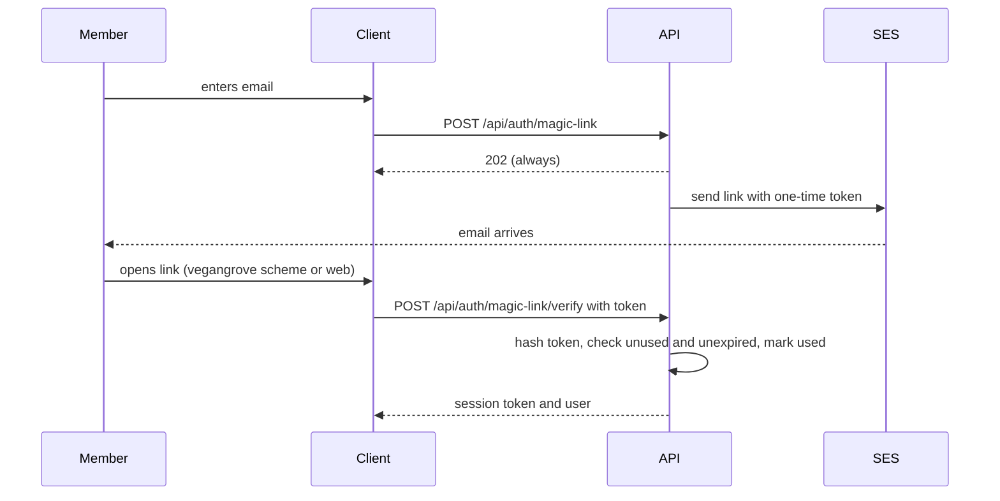
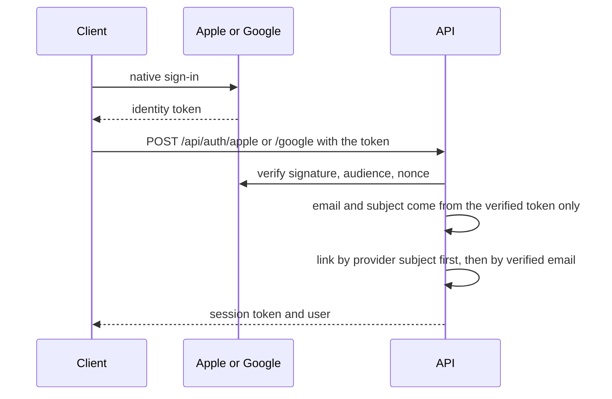

# Auth and sessions

Status: **Scaffolded 2026-09-24**

Four ways in, one kind of session. The decision record is [ADR-0003](/architecture/adrs/adr-0003-auth).

## Sign-in methods

| Method | Route | Notes |
|---|---|---|
| Email + password | `POST /api/auth/register`, `POST /api/auth/login` | argon2id hashes, rate limited |
| Magic link | `POST /api/auth/magic-link`, then `POST /api/auth/magic-link/verify` | Always answers 202. Works with any address, including Proton. 15-minute single-use token. |
| Sign in with Apple | `POST /api/auth/apple` | Identity token verified against Apple's keys. Email taken from the token only. Hide My Email works. |
| Google | `POST /api/auth/google` | ID token verified with `google-auth-library` against the configured client ids. |

Proton has no public identity provider for third-party apps, so there is no "Sign in with Proton". Proton users get the magic link, which is the most private option on the list anyway: no password to reuse, no third party told that you signed in.

## Sessions

A session token is 32 random bytes, base64url encoded, returned exactly once. The API stores only its SHA-256 hash with a 30-day sliding `expiresAt` (a TTL index deletes it). Every request carries `Authorization: Bearer <token>`. The middleware hashes the token, loads the session and the user, refuses deleted users, and bumps `lastSeenAt` at most once an hour.

Why not a JWT: a JWT cannot be revoked before it expires, which is why The Trick Book had a seven-day window after any compromise and a demoted admin who stayed admin. Opaque sessions are revocable per device from settings, and account deletion drops them instantly. The cost is one indexed lookup per request, which is fine at this scale and stays fine well past it.

The web app never sees the token in JavaScript. A Next route handler exchanges credentials with the API and stores the token in the httpOnly `vg_session` cookie; server components forward it as a Bearer header. Mobile keeps it in SecureStore.

## Magic link flow

## SSO flow and the takeover it prevents

The Trick Book's Apple route accepted an `email` field in the body and preferred it over the token's, which let anyone with a valid Apple token take over any account by email. Here the body has no email field, and if the token carries no email (Apple's private relay users can withhold it) the account is created with the subject alone.

## Roles

`role` is `member` or `admin`. It lives on the user document and is read from the database on every admin request. It is never encoded in a token or cookie. Organizer is not a role; it is a row in `grove_members` or `organizations.adminUserIds`, checked against the specific Grove or organization each time.

## Account deletion

`DELETE /api/me` runs the cascade in [ADR-0010](/architecture/adrs/adr-0010-account-deletion) and revokes every session in the same transaction.
