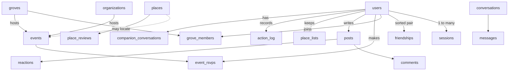

# Data model

Status: **Scaffolded 2026-09-24**, ingest fields added 2026-09-29 per the [ingest contract](/ingest)

Every collection is a Mongoose schema in `vegan-grove-api/src/models`, with `timestamps: true`, every reference an `ObjectId`, and every index declared in the schema. That last sentence is the whole lesson from The Trick Book, where 38 collections were shaped by whichever `insertOne` ran first and `userId` was an ObjectId, a string, or a DBRef depending on the file.

The field-level privacy view is the [data inventory](/privacy/data-inventory). This page is the structural view.

## Relationships

```mermaid
flowchart TB
  User["users"]
  User -->|1 to many| Sessions["sessions"]
  User -->|sorted pair| Friendships["friendships"]
  User -->|joins| GroveMembers["grove_members"]
  Groves["groves"] --> GroveMembers
  Groves -->|hosts| Events["events"]
  Orgs["organizations"] -->|hosts| Events
  Places["places"] -.->|may locate| Events
  Events --> Rsvps["event_rsvps"]
  User -->|makes| Rsvps
  User -->|writes| Posts["posts"]
  Posts --> Comments["comments"]
  Posts --> Reactions["reactions"]
  Places --> Reviews["place_reviews"]
  User -->|keeps| Lists["place_lists"]
  Conversations["conversations"] --> Messages["messages"]
  User -->|records| Actions["action_log"]
  User -->|has| Companion["companion_conversations"]
```

## Collections by domain

### Identity

| Collection | Key fields | Indexes |
|---|---|---|
| `users` | `email` (lowercase), `emailVerifiedAt`, `passwordHash?`, `handle`, `avatarKey?`, `homeArea`, `discoverable`, `publicPostsEnabled`, `role`, `providers[]`, `interests[]`, `deletedAt?` | unique `email`, unique `handle`, `providers.provider + providers.subject` |
| `sessions` | `userId`, `tokenHash`, `expiresAt`, `lastSeenAt`, `client` | unique `tokenHash`, TTL `expiresAt`, `userId` |
| `magic_links` | `email`, `tokenHash`, `expiresAt`, `usedAt?` | unique `tokenHash`, TTL `expiresAt` |

### Social graph

| Collection | Key fields | Indexes |
|---|---|---|
| `friendships` | `userA`, `userB` (sorted so the pair is canonical), `status`, `requestedBy` | unique `userA + userB`, `userB` |
| `friend_invites` | `userId`, `code`, `expiresAt`, `usesLeft` | unique `code`, TTL `expiresAt` |
| `groves` | `name`, `slug`, `area`, `description`, `memberCount` | unique `slug`, `area` |
| `grove_members` | `groveId`, `userId`, `role` | unique `groveId + userId`, `userId` |
| `organizations` | `name`, `slug`, `type`, `description`, `website?`, `socials` (handles only), `area?`, `verified`, `adminUserIds[]`, plus provenance | unique `slug`, unique `source + sourceId` |

### Places and events

| Collection | Key fields | Indexes |
|---|---|---|
| `places` | `name`, `slug`, `type` (now including `garden`), `veganLevel`, `location` (GeoJSON Point), `address`, `city`, `postcode`, `area` (derived from coordinates), `website`, `phone`, `hours`, `tags[]`, `description`, `chain`, `photoKeys[]`, `approvalStatus`, `submittedBy?`, `ratingAvg`, `reviewCount`, plus [provenance](#provenance-on-ingested-collections) | unique `slug`, 2dsphere `location`, `approvalStatus + type`, `approvalStatus + veganLevel + chain`, unique `source + sourceId`, sparse unique `osmId` (legacy, equal to `sourceId` on OSM rows) |
| `place_reviews` | `placeId`, `userId`, `rating`, `content`, `visitedMonth`, `showHandle`, `status` | `placeId + createdAt`, `userId` |
| `place_lists` | `userId`, `name`, `placeIds[]`, `isPublic` | `userId` |
| `events` | `title`, `slug`, `type`, `startsAt`, `endsAt`, `location?` (absent on an ingested event with no coordinates), `placeId?`, `venueName`, `address`, `detailsAfterRsvp`, `hostType`, `hostId`, `description`, `coverKey?`, `visibility`, `rsvpCount`, `status` (`draft`, `pending`, `published`, `cancelled`; `pending` is the ingest landing state), `createdBy?` (absent on ingested events), plus provenance | unique `slug`, 2dsphere `location`, `startsAt + status`, `hostType + hostId`, unique `source + sourceId` |
| `event_rsvps` | `eventId`, `userId`, `status` | unique `eventId + userId`, `userId` |

### Feed

| Collection | Key fields | Indexes |
|---|---|---|
| `posts` | `userId`, `mediaType`, `imageKeys[]`, `bunnyVideoId?`, `caption`, `visibility`, `groveId?`, `placeId?`, `eventId?`, `stats`, `status` | `userId + createdAt`, `visibility + createdAt`, `groveId + createdAt` |
| `comments` | `postId`, `userId`, `parentId?`, `content`, `status` | `postId + createdAt` |
| `reactions` | `postId`, `userId`, `type` | unique `postId + userId` |
| `saved_posts` | `postId`, `userId` | unique `postId + userId` |
| `reports` | `targetType`, `targetId`, `reportedBy`, `reason`, `status` | `status + createdAt` |

### Messages

| Collection | Key fields | Indexes |
|---|---|---|
| `conversations` | `participantIds[]` (sorted), `lastMessageAt`, `unread` | unique `participantIds`, `participantIds + lastMessageAt` |
| `messages` | `conversationId`, `senderId`, `ciphertext`, `iv`, `keyId`, `type`, `expiresAt` | `conversationId + createdAt`, TTL `expiresAt` |

### Content and companion

| Collection | Key fields | Indexes |
|---|---|---|
| `media_items` | `title`, `slug`, `kind`, `year`, `releaseDate?`, `synopsis`, `tagline?`, `posterKey?`, `backdropKey?`, `runtimeMinutes?`, `directors[]`, `featuring[]`, `genres[]`, `rating?`, `ratingCount?`, `contentRating?`, `originalLanguage?`, `watchLinks[] { provider, url, access }`, `trailerYoutubeId?`, `officialSite?`, `tags[]`, `contentWarnings[]`, `actions[] { label, url, type, org? }`, `stats { saves, moved, acted }`, `externalIds { tmdb, wikidata, imdb }`, `featured`, `status`, plus provenance | unique `slug`, `status + featured + _id`, `status + year + _id`, `status + tags`, `status + genres`, `status + watchLinks.access`, unique `source + sourceId` |
| `media_collections` | `slug`, `name`, `description`, `order`, `published`, `itemIds[]` (ordered) | unique `slug`, `published + order` |
| `saved_media` | `mediaId`, `userId` | unique `mediaId + userId`, `userId + _id` |
| `media_reactions` | `mediaId`, `userId`, `type` (`moved`, `acted`) | unique `mediaId + userId + type` |
| `guides` | `title`, `slug`, `category`, `summary`, `body`, `sources[] { title, url, license }`, `status`, plus provenance | unique `slug`, `category`, unique `source + sourceId` |
| `action_log` | `userId`, `type`, `eventId?`, `hours?`, `note?`, `occurredAt` | `userId + occurredAt` |
| `companion_conversations` | `userId`, `messages[]`, `pinned`, `expiresAt?` | `userId`, TTL `expiresAt` |

### Notifications

| Collection | Key fields | Indexes |
|---|---|---|
| `push_tokens` | `userId`, `token`, `platform`, `deadAt?` | unique `token`, TTL `deadAt` |
| `notification_preferences` | `userId`, `eventReminders`, `friendRequests`, `messages`, `quietHours?` | unique `userId` |
| `scheduled_notifications` | `userId`, `kind`, `payload`, `scheduledFor`, `status`, `idempotencyKey` | unique `idempotencyKey`, `scheduledFor + status` |

## Provenance on ingested collections

`places`, `events`, `organizations`, `media_items`, and `guides` can be written by the [ingest endpoint](/ingest). Each carries the same five fields: `source` (a string id such as `osm`, `curated`, `ics:<org-slug>`, `wikidata`, `bot:grokbot`), `sourceId` (stable within the source), `sourceUrl?`, `lastSeenAt`, and `adminEdited: string[]`, the field paths an admin changed through the admin routes. The unique index on `source + sourceId` is the upsert key. It is a partial index over rows that have a `sourceId`, so member-submitted places (`source: user`) are unaffected. An ingest write sets only fields absent from `adminEdited` and never lowers a moderation state. None of the five fields references a member.

## Conventions

- Derived counters (`memberCount`, `rsvpCount`, `ratingAvg`, `reviewCount`, `stats`) are maintained by the service that owns the write and recomputed by a nightly worker. They are never trusted for permission checks.
- TTL indexes carry the retention policy: sessions, magic links, invites, messages, unpinned companion conversations, dead push tokens.
- Soft delete exists only on `users` (`deletedAt`) so that a deleted account's handle is released after a cooling period. Every other deletion is hard.
- Geo queries are bounding-box `$geoWithin` on the 2dsphere index. There is no `$near` query anywhere, because `$near` needs a point, and the client never sends one.
