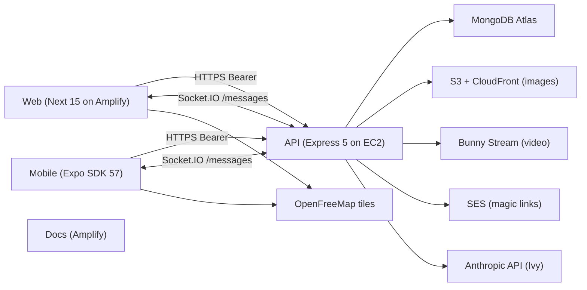

# Architecture overview

Status: **Scaffolded 2026-09-24**

Vegan Grove is a client-server system with one shared API. Two clients (web and mobile) talk to it over HTTPS and, for messaging, a Socket.IO namespace. The API owns every rule about who can see what. Clients never filter for privacy; they only render what the API already decided to return.

## The four repos

| Repo | Role | Deploys to |
|---|---|---|
| `vegan-grove-api` | REST API, Socket.IO, workers, the only thing that reads the database | EC2 `us-east-1`, PM2 behind nginx |
| `vegan-grove-web` | Public site plus the authenticated `/app` area | AWS Amplify Hosting |
| `vegan-grove-mobile` | iOS and Android app | EAS Build, App Store, Play |
| `vegan-grove-docs` | This site | AWS Amplify Hosting |

See the [repo dependency map](/architecture/repo-dependency-map) for the contracts between them and [ADR-0001](/architecture/adrs/adr-0001-polyrepo) for why four repos and not one.

## Boundaries that matter

- **Principal from the session.** Every authenticated request carries an opaque session token. The API resolves it to a user and never trusts an id, email, or role from a request body. See [auth and sessions](/architecture/auth-and-sessions).
- **Visibility on the server.** Feed, events, attendees, friends, and messages are filtered by visibility in the query, not after. A client cannot ask for more than it is allowed to see.
- **Bytes bypass the API.** Images upload straight to S3 with a presigned PUT, video straight to Bunny with a short-lived TUS credential. The API never proxies media. Metadata is stripped on the device before either.
- **Clients hold one secret.** The session token, in SecureStore on mobile and an httpOnly cookie on web. No JWT decoding on the client, no role in local storage.
- **The database is reachable from one place.** Atlas allows connections only from the API host's fixed IP. That constraint is the reason the API runs on a box and not on Lambda ([ADR-0002](/architecture/adrs/adr-0002-backend-hosting)).

## What is not in v1

Realtime feed comments, end-to-end encrypted messages, on-device companion inference, and payments. Each has a slot: the `/feed` Socket.IO namespace is documented but not wired, [ADR-0011](/architecture/adrs/adr-0011-messages-encryption) reserves the E2E design, and there is no Stripe code to remove later.

## Where the Trick Book shape was kept and where it was not

Kept: one shared API, the router factory pattern, per-feature Socket.IO namespaces with `user:` and `conversation:` rooms, the notifications subsystem shape, presigned uploads, the cached public stats endpoint, Amplify with the env allowlist, EAS profiles with a release guard, PokeDocs with an explicit sidebar.

Changed: TypeScript everywhere, Mongoose schemas instead of ad-hoc collections, opaque sessions instead of a seven-day JWT in a custom header, `Authorization: Bearer`, server-side auth gating on the web, security headers, tests from the first commit, and nothing personal in logs or docs.
