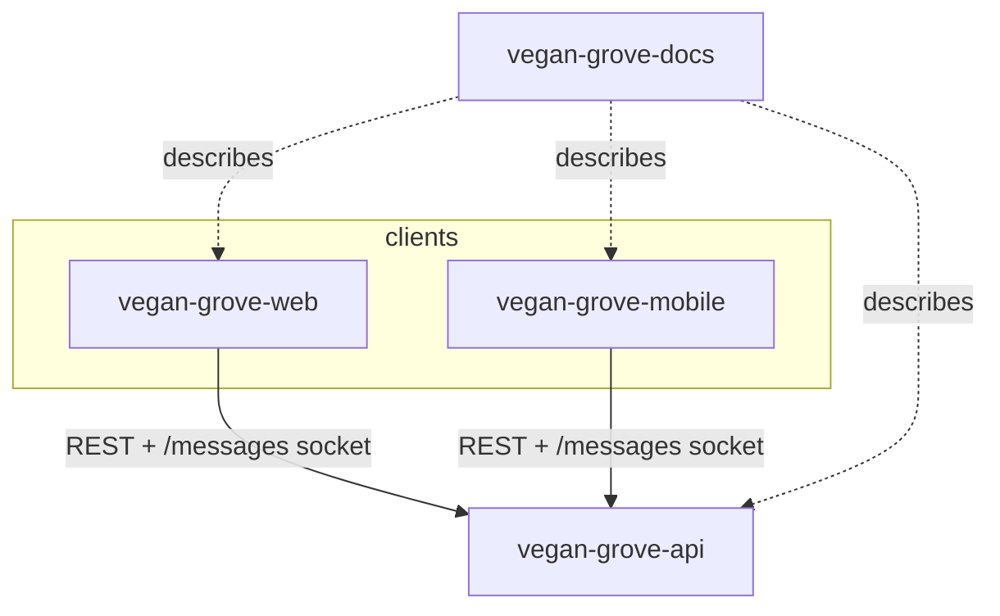

# Repo dependency map

Status: **Scaffolded 2026-09-24**

Four repositories, one runtime dependency direction: both clients depend on the API's route contracts and socket events. The docs depend on all three for accuracy and on nothing at runtime.

## Client modules to API route groups

The API surface is listed in full in [backend API endpoints](/backend/api-endpoints).

| Web module (`src/lib/`) | Mobile module (`src/lib/api/`) | API route group |
|---|---|---|
| `api.ts` (shared client) | `client.ts` (shared client) | all |
| session route handler | `auth.ts` | `/api/auth/*`, `/api/me` |
| `places.ts` | `places.ts` | `/api/places`, `/api/place-lists` |
| `events.ts` | `events.ts` | `/api/events`, `/api/groves`, `/api/organizations` |
| `friends.ts` | `friends.ts` | `/api/friends/*` |
| `feed.ts` | `feed.ts` | `/api/feed`, `/api/posts`, `/api/reports` |
| `uploads.ts` | `uploads.ts` | `/api/uploads/*` |
| `messages.ts` + socket | `messages.ts` + socket | `/api/conversations`, namespace `/messages` |
| `media.ts` | `media.ts` | `/api/media` |
| `guides.ts` | `guides.ts` | `/api/guides` |
| `companion.ts` (SSE) | `companion.ts` (SSE) | `/api/companion/*` |
| | `notifications.ts` | `/api/push-tokens`, `/api/me/notification-preferences` |

The scaffold ships the shared clients plus `auth`, `places`, `events`, and `me` modules. The rest are created as their milestones land.

## Auth and session contracts

| Concern | Contract |
|---|---|
| REST auth header | `Authorization: Bearer <session token>` |
| Socket auth | `socket.handshake.auth.token = <session token>` |
| Web sign-in | Browser posts to the Next route handler `/api/session`, which calls the API and sets the `vg_session` httpOnly cookie |
| Mobile sign-in | App posts to `/api/auth/*` directly and stores the token in SecureStore |
| Error envelope | `{ error: { code, message } }` |
| List envelope | `{ items, nextCursor }` |

## Socket event contracts

Namespace `/messages` (auth required):

- Client emits: `join:conversation`, `leave:conversation`, `typing:start`, `typing:stop`
- Server emits: `message:new`, `messages:read`, `typing:start`, `typing:stop`
- Rooms: `user:<id>` on connect, `conversation:<id>` on join, membership checked against the conversation's participants before joining

Namespace `/feed` is reserved for realtime comments and is not wired in v1.

## External dependencies

| Service | Used by | Purpose |
|---|---|---|
| MongoDB Atlas | API only | All data |
| S3 + CloudFront | API (presign), clients (PUT, GET) | Images |
| Bunny Stream | API (create, status), clients (TUS upload, HLS playback) | Video |
| SES | API | Magic links, account mail |
| Anthropic API | API | Ivy |
| OpenFreeMap | Clients | Map tiles, no key |
| Apple, Google | Clients (SDKs), API (token verification) | SSO |
| Expo push | API | Notifications |

## Change management rules

1. Backend route contracts are shared public API. Changing a response shape requires updating both clients in the same milestone.
2. Keep `Authorization: Bearer` and the two envelopes stable. Anything else is a new route, not a changed one.
3. Socket event changes update web and mobile listeners in the same release.
4. A new personal field needs a [data inventory](/privacy/data-inventory) row before the schema change merges.
5. Docs pages that describe a route group are updated in the same PR that changes it, or the PR links a docs PR.
