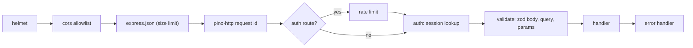

# Backend overview

Status: **Scaffolded 2026-09-24**

`vegan-grove-api` is the one server. Both clients talk to it and nothing else holds member data. Its job is narrow: authenticate a session, validate input, enforce visibility, query Atlas, and hand back an envelope. Bytes (images, video) and map tiles never pass through it.

## Stack

TypeScript on Node 24. Express 5, Mongoose 9, zod at every route boundary, pino and pino-http for [logging](/engineering/logging), helmet 8, cors with an allowlist from env, express-rate-limit on auth and companion routes, Socket.IO for the `/messages` namespace (session token in `handshake.auth.token`, no JWT), the AWS SDK for S3 presigning, the Anthropic SDK for the companion, nodemailer over SES SMTP for magic links, argon2 for passwords. Tests: vitest, supertest, mongodb-memory-server. Runs under PM2, see [backend deployment](/deployment/backend).

## Layout

```
src/
  config/     env.ts: every variable, validated once at boot
  db/         Mongoose connection, index sync, graceful disconnect
  models/     one file per collection from the data model
  routes/     one router per resource, zod schemas beside the handlers
  services/   logic that outlives one request: auth, places, companion, crypto, email, stats
  middleware/ auth (session lookup), validate (zod), rateLimit, errorHandler
  workers/    reminder tick, TTL-adjacent cleanup, start and stop wired to shutdown
  lib/        errors.ts, logger.ts, cursor.ts, small pure helpers
  socket/     the /messages namespace and room names
  app.ts      buildApp: middleware chain and routers, returns an Express app, never listens
  server.ts   loads env, connects, listens, handles SIGTERM
```

`ecosystem.config.cjs` at the root is the PM2 definition. `scripts/seed-places-osm.ts` is the Overpass importer stub behind `seed:places:osm`.

## Request lifecycle



Order matters. helmet and cors run before anything can echo input. pino-http runs before auth so a rejected request still gets a log line with a request id. The auth middleware resolves `Authorization: Bearer <token>` by hashing the token and finding the session, attaches `req.session` and `req.user` (or nothing, for public routes), and never trusts a body field. `validate` replaces `req.body`, `req.query`, and `req.params` with the parsed values, so handlers see typed, trimmed input. The error handler is last and renders the one envelope described in [error handling](/engineering/error-handling).

Admin routes add a per-request role check that reads `role` from the database, not from the session, so revoking admin takes effect on the next request.

## `buildApp` and `server.ts`

`app.ts` exports `buildApp({ env, logger })` and returns a configured app without calling `listen`. `server.ts` is the only file with side effects: it runs `loadEnv()`, connects Mongoose, creates the HTTP server, attaches Socket.IO, starts workers, listens, and on `SIGTERM` stops accepting connections, closes the socket namespace, stops workers, drains in-flight requests, and disconnects from Atlas.

The split exists for tests. A test calls `buildApp` with a test env and a silent logger, mounts it in supertest, and never opens a port. The same app object runs in production; only the file that starts it differs. See [backend testing](/backend/testing).

## Where to go next

- [API endpoints](/backend/api-endpoints): the full surface with auth levels and what the scaffold implements.
- [Database](/backend/database): collections, indexes, TTLs.
- [Configuration](/backend/configuration): every environment variable.
