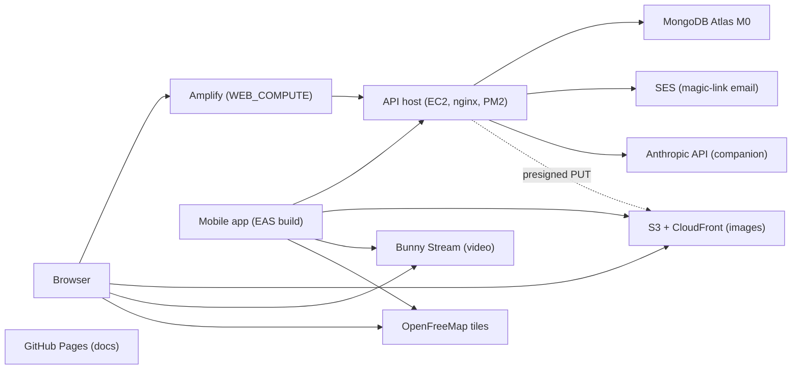

# Deployment overview

Status: **Proposed 2026-09-24**

This section is the source of truth for shipping. Nothing is provisioned yet; the pages describe the target so the first deploy follows a written runbook instead of inventing one.

Per the [disclosure policy](/privacy/disclosure-policy), these pages name services, regions, and roles only. No IP addresses, instance ids, hostnames of machines, ports, process names, key names, or SSH commands appear here. A step that needs a host is written as `ssh <api-host>`, and the value lives in the maintainer's private runbook.

## Components

| Component | Platform | Region | Deploy trigger |
|---|---|---|---|
| API (`vegan-grove-api`) | EC2 t4g.micro, Ubuntu 24.04 arm64, PM2 behind nginx | `us-east-1` | manual runbook on the API host, see [backend](/deployment/backend) |
| Web (`vegan-grove-web`) | Amplify Hosting, WEB_COMPUTE | `us-east-1` | push to `main`, see [web app](/deployment/web-app) |
| Mobile (`vegan-grove-mobile`) | EAS Build, TestFlight, Play internal track | Expo's build cloud | `eas build` on a store profile, see [mobile](/deployment/mobile) |
| Docs (`vegan-grove-docs`) | GitHub Pages via Actions | GitHub's CDN | push to `main`, see [docs](/deployment/docs) |
| Database | MongoDB Atlas M0 | `us-east-1` (AWS provider) | none, schema changes ship with the API |
| Images | S3 bucket behind CloudFront | `us-east-1`, global edge | presigned PUT from clients, no deploy |
| Video | Bunny Stream | Bunny's CDN | tus upload from clients, no deploy |
| Email | SES SMTP | `us-east-1` | none, sandbox until production access is granted |
| DNS | Route 53 hosted zone for `vegangrove.org` | global | manual |

## Topology

Clients never send bytes through the API: images go straight to S3 with a presigned URL and video goes straight to Bunny with a tus token. The API host therefore stays small. Map tiles come from OpenFreeMap directly to the client; the API never sees a viewport.

## Release order

When a web change depends on an API change: deploy the API first, confirm `GET /healthz` and the changed endpoint, then merge the web PR and wait for the Amplify job to report success. Mobile builds in the stores keep working against the old API for as long as members take to update, so API changes are additive until a store version is retired.

## Costs

Everything above runs for about $12 to $15 a month at MVP traffic. The [cost sheet](/deployment/cost-sheet) breaks it down and names the free tiers it depends on.
