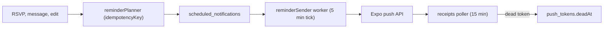

# Notifications

Status: **Proposed 2026-09-24**, worker stubbed in the API

Notifications carry the subsystem shape from The Trick Book almost unchanged, because it is the best-engineered part of that codebase: idempotency keys, TTL indexes, a receipts poller, and a soft-ask on the device. What is removed is any analytics attached to them.

## What ships in v1

| Kind | Trigger | To |
|---|---|---|
| Event reminder | 24 hours and 2 hours before an event the member RSVP'd to | Attendee |
| Event changed or cancelled | Organizer edits time, place, or cancels | Attendees |
| RSVP milestone | Count crosses 10, 25, 50, 100 | Organizer (count only) |
| Friend request | Someone sends a request | Recipient |
| Friend accepted | Request accepted | Requester |
| New message | Message in a conversation | Participants, respecting quiet hours |
| Place approved | A member's submission is approved | Submitter |

Nothing marketing, nothing "we miss you", nothing triggered by inactivity.

## Device flow

1. The app never asks for push permission on first launch. It asks in context: after the first RSVP ("want a reminder?") or the first message, with a 14-day cooldown if declined.
2. On grant, the Expo push token is registered at `POST /api/push-tokens` with the platform.
3. On logout or account deletion, the token is unregistered.
4. Tapping a notification deep-links (scheme `vegangrove`) to the event, conversation, or request.

## Server flow

- Every scheduled notification has an idempotency key (`event:<id>:reminder24h:user:<id>`), so re-planning after an edit is safe.
- Quiet hours are per member (default 22:00 to 08:00 local, from the device's timezone sent at registration as an offset, not a location). Messages during quiet hours are delivered silently.
- Dead tokens (Expo receipt `DeviceNotRegistered`) are marked and purged after 30 days.

## Data and visibility

`push_tokens`, `notification_preferences`, `scheduled_notifications`. All self-visibility. Notification payloads contain a handle and an event title at most, never message text (the body says `New message from <handle>`).

## API

`POST`/`DELETE /api/push-tokens`, `GET`/`PUT /api/me/notification-preferences`.

## Open questions

- Email fallback for members without push. Proposal: event reminders only, opt-in, M3.
- Web push. Proposal: not in v1; the web app shows an in-app badge.
