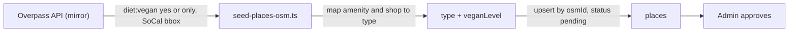

# Place data sources

Status: **Proposed 2026-09-24**, importer stubbed in the API

Three sources, in order of trust: curated, member-submitted, imported. All three land as `pending` and are approved by an admin before they appear.

## Curated

Sanctuaries and organizations are curated by hand from their own websites, because they are few, they matter most, and their details (visiting rules, volunteer programs) do not live in any open dataset. `source: 'curated'`.

## Member-submitted

Any signed-in member can submit a place with a pin, a type, a vegan level, and a photo. `source: 'user'`, `submittedBy` stored for moderation and never displayed.

## OpenStreetMap

OpenStreetMap tags places with `diet:vegan=yes` (vegan options) and `diet:vegan=only` (fully vegan). A bounding box over Southern California (roughly Ventura to the Mexican border, the coast to the Inland Empire) contained 531 such places on 2026-09-24. This is the seed for restaurants, cafes, groceries, and shops.

The importer is `scripts/seed-places-osm.ts` in the API repo:

Rules:

- Query `nwr["diet:vegan"~"^(yes|only)$"]` over the bbox, `out center tags`.
- `amenity=restaurant|fast_food` to `restaurant`, `amenity=cafe|ice_cream` to `cafe`, `shop=supermarket|greengrocer|health_food|convenience` to `grocery`, other `shop=*` to `shop`. Unknown tags are skipped and counted.
- `diet:vegan=only` to `veganLevel: 'full'`, `yes` to `'options'`.
- Upsert by `osmId` so re-runs update rather than duplicate. Existing approved places keep their approval; changed coordinates or names are flagged for review, not overwritten.
- The importer sends a descriptive `User-Agent` and runs against the Kumi Systems mirror, because the main Overpass instance refuses generic clients.
- `--dry-run` prints counts only. The importer never runs in CI and never against production without a human in the loop.

Attribution: OpenStreetMap data is ODbL. Every Place with `source: 'osm'` shows "Data from OpenStreetMap contributors" on its page, and the map itself carries the OSM attribution through the tile style.

## What is not a source

- HappyCow, Yelp, Google Places. Their terms forbid bulk use, and Google Places would put a Google key back into the product ([ADR-0006](/architecture/adrs/adr-0006-maps)).
- Social media scraping.
- The Trick Book's Chrome extension pattern (scraping Google Maps from a browser). Deprecated there, not carried here.

## Refresh

A quarterly manual run of the importer with `--dry-run`, review of the diff, then a real run. New OSM places enter as `pending`.
