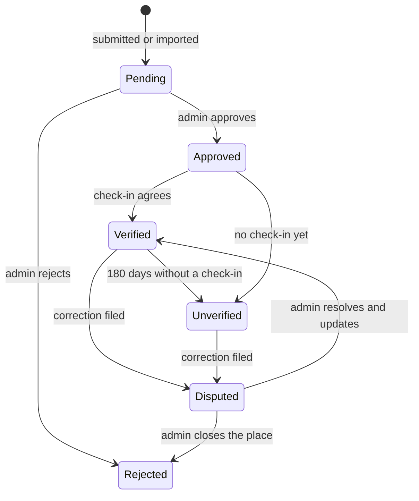

# Place verification

Status: **Proposed 2026-09-24**

A map of vegan places is only as good as its worst entry. A restaurant that dropped its vegan menu six months ago and still shows `full` costs a member a wasted trip and costs the app trust. The Trick Book has an admin-only `verified` flag on spot trick history; Vegan Grove needs verification that scales with members and stays anonymous.

## Signals

| Signal | Source | Weight |
|---|---|---|
| Approval | Admin reviewed the submission | Required to appear at all |
| Check-in | A member visited and confirmed the vegan level (rating optional) | Strong, decays over time |
| Correction | A member reports "vegan level is wrong" or "closed" | Strong negative, triggers review |
| Claim | The business claimed the Place and set details | Medium, shown as "claimed" |
| Source freshness | OSM last-modified date, curated review date | Weak |

A Place shows one of three verification states derived from these signals: **Verified** (a check-in in the last 180 days that agrees with the level), **Unverified** (no recent check-in), **Disputed** (an open correction). Disputed places stay on the map with the badge; they are not hidden, because a member is better served by "someone says this changed" than by silence.

## Anonymity

- Check-ins store `userId` for the aggregation and for rate-limiting one check-in per member per place per month. The Place page shows counts and the latest month, never who.
- A check-in that includes a review shows the handle only if the member opted in on that review.
- Corrections are reports (`reports` collection, target type `place`) and are handled by admins. The reporter is never shown.
- Admin tooling shows the handle of a reporter only when needed to handle abuse, and never lists them.

## Flow

## Open questions

- Should a fully vegan place that receives a "now has non-vegan items" correction flip to `options` automatically after two independent corrections, or always wait for an admin? Proposal: wait for an admin in v1, automate when there is data on false-correction rates.
- Whether businesses that claim a Place can see check-in counts. Proposal: yes, counts only.
