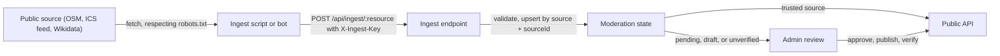

# Data ingest

Status: **Proposed 2026-09-29**, binding on the API, the scripts, and the bot

Vegan Grove's public data (places, events, organizations, media, guides) is fed by ingest scripts in the API repo and by an external automation bot. Both talk to one endpoint under one contract. This section has two readers: a person, and an agent that performs the ingest on a schedule. An agent reads this page, then the page for the resource it is ingesting, then the [runbook](/ingest/bot-runbook).

Ingested rows are public content only. No page in this section touches member data, and the bot never receives any.

## Flow



## Provenance

Every ingested row carries four fields. They are what makes a re-run safe.

| Field | Meaning |
|---|---|
| `source` | String id of the data origin: `osm`, `curated`, `ics:<org-slug>`, `jsonld:<org-slug>`, `wikidata`, `tmdb`. `bot:grokbot` is reserved for content the bot authored itself (guide drafts), not for data it relayed. |
| `sourceId` | Stable id inside that source. OSM places use the existing `osmId` (`node/123`, `way/456`). |
| `sourceUrl` | Where a person can see the original. Required on events. |
| `lastSeenAt` | Set on every call that carries the row, including `unchanged` ones. Rows that stop appearing are never deleted by ingest; admins find them by age. |

The upsert key is `(source, sourceId)`. A `slug` is generated from the name on insert and never changes on update.

## Moderation

| Resource | Default landing state | With a trusted source |
|---|---|---|
| places | `approvalStatus: pending` | `approved` |
| events | `status: pending` | `published` |
| organizations | `verified: false` | `verified: true` |
| media, guides | `status: draft` | `published` |

`TRUSTED_SOURCES` is a comma-separated list of source ids in the API environment. The bot cannot read it and the response does not reveal it, so the bot treats every row as pending. Two rules hold on every re-ingest: a moderated row never moves backwards (approved stays approved, rejected stays rejected, published stays published, verified stays verified), and a field an admin edited is never overwritten. Admin edits are tracked per row in `adminEdited: string[]`, the list of field paths the ingest skips.

## Endpoint

`POST /api/ingest/:resource` where `resource` is `places`, `events`, `organizations`, `media`, or `guides`.

Headers: `Content-Type: application/json` and `X-Ingest-Key`. The key is compared in constant time against `INGEST_KEY`. A wrong key is `401 unauthorized`. Until the key exists in the environment every ingest route answers `503 not_configured`. An admin session (`Authorization: Bearer`) may call the same routes.

Body: `{ source, items }` with at most 200 items. Each item is validated with zod against the schema on its resource page. An envelope problem (missing `source`, more than 200 items) is `400 validation_error` and nothing is written.

Rate limit: 60 calls per 15 minutes per key, then `429 rate_limited` with a `Retry-After` header in seconds.

Request:

```text
POST /api/ingest/places
Content-Type: application/json
X-Ingest-Key: (the key)

{
  "source": "osm",
  "items": [
    {
      "sourceId": "node/123456789",
      "name": "Green Leaf Cafe",
      "type": "cafe",
      "veganLevel": "full",
      "location": { "lng": -118.1937, "lat": 33.7701 },
      "address": "123 4th St",
      "city": "Long Beach",
      "postcode": "90802",
      "tags": ["cuisine:thai"],
      "sourceUrl": "https://www.openstreetmap.org/node/123456789"
    }
  ]
}
```

Response when every item was accepted (`200`):

```json
{ "inserted": 1, "updated": 0, "unchanged": 0, "rejected": [] }
```

Response when one item was rejected (`207`):

```json
{
  "inserted": 3,
  "updated": 1,
  "unchanged": 0,
  "rejected": [
    {
      "index": 2,
      "sourceId": "node/987",
      "errors": [{ "path": "location.lat", "message": "Expected number, received string" }]
    }
  ]
}
```

`207` means the accepted items were written and the rejected ones were not; `index` is the item's position in the request. Every item rejected is still `207`. `unchanged` counts items whose content matched the stored row; they still refresh `lastSeenAt`.

## Logging

Every call logs the route, the source, and the four counts. Item bodies are never logged, per the [logging rules](/engineering/logging). Nothing about a member can appear, because ingest carries none.

## Legal principles

- Respect `robots.txt` and each site's terms. Fetch with a descriptive `User-Agent` that names the project and a contact page.
- Attribute: OpenStreetMap under ODbL, Wikidata under CC0, "Watch providers data by JustWatch" wherever TMDB-sourced watch links render.
- No personal data. Organizer names, attendee lists, and personal social accounts are dropped at the source, never stored.
- No hotlinked images. A poster or photo is uploaded to the app's own bucket first; the API never fetches a remote image.
- Never scrape Facebook, Instagram, Meetup, or Eventbrite HTML.
- `--dry-run` first on every script and every new source, and never against production without it.

## Resources

[Places](/ingest/places), [Events](/ingest/events), [Organizations](/ingest/organizations), [Media](/ingest/media), [Guides](/ingest/guides), and the [bot runbook](/ingest/bot-runbook).
