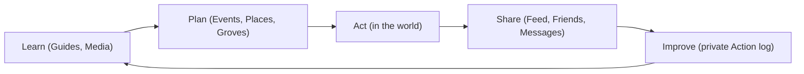

# Vision

Status: **Proposed 2026-09-24**

Vegan Grove is a privacy-first activism engine for Southern California's vegan community. It is not a review site with a forum bolted on. It is the tool an organizer wishes existed: every sanctuary, every vegan spot, every action this month, and a crew to go with, without ever putting a member on a public list.

This page is the docs version of `SOUL.md`, which ships in every repo and is the first thing any contributor or coding agent reads.

## Three forces

- **Compassion.** Everything here exists for the animals. A feature that does not eventually help an animal is decoration.
- **Action.** A sanctuary volunteer day, a vigil, a cube of truth, a potluck that turns a curious friend vegan. The app is measured by actions in the world, not time in the app.
- **Community.** Activism is lonely without a crew. The app makes it easy to find your people and hard for anyone else to find them.

## The loop

**Learn, Plan, Act, Share, Improve.**

The Trick Book runs Learn, Plan, Ride, Share, Improve. Same loop, one verb swapped, and a very different rule about who can see the Share step.

## Ethos

- **Activists first.** Organizers and members are the customers. Businesses and orgs are guests.
- **Privacy is the floor.** Collect the minimum. Profiles are never public. Default to friends-only. If a feature needs more data than it deserves, the feature changes.
- **Open about the system, closed about the people.** Code, docs, roadmap, and data inventory are public. Membership, movement, and conversations are not.
- **Utility with soul.** Cyberpunk on the surface: neon on near-black, monospace accents, terminal honesty. Underneath: fast, correct, boring in the best way.
- **Culture over clout.** No follower counts, no public leaderboards, no engagement bait.

## Build order

Trust, then the core loop, then delight, then expansion. Trust means auth, privacy defaults, deletion, and encryption are right before anything else ships. The [milestones](/roadmap/milestones) follow that order.

## Compass

Vegan Grove should feel like the sharpest, kindest organizer you know: knows every sanctuary, every vegan spot, every action this month, and would never give out your number.
