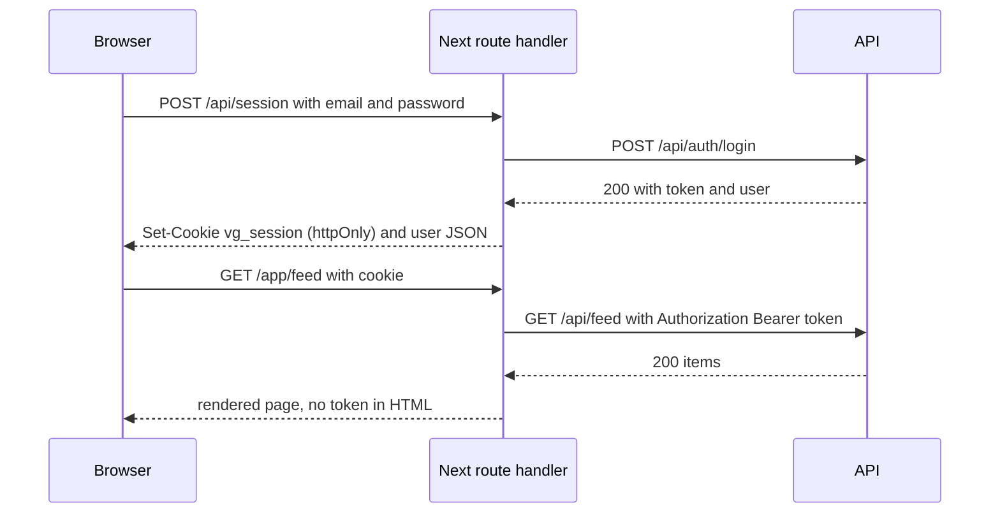

# Auth and sessions

Status: **Scaffolded 2026-09-24**

The browser never holds the API session token. It holds an httpOnly cookie that only the Next server can read, and the Next server turns that cookie into a Bearer header when it talks to the API. This page is the web half of [auth and sessions](/architecture/auth-and-sessions).

## The cookie

`vg_session`: `HttpOnly`, `Secure` (off only on `localhost` in development), `SameSite=Lax`, `Path=/`, `Max-Age` equal to the API's `SESSION_TTL_DAYS`. Its value is the API session token, unchanged. No JWT, no claims, nothing to decode: the API looks up the hashed token on every request, so revoking a session in settings takes effect immediately everywhere.

## `src/app/api/session/route.ts`

The one route handler that touches the cookie. It proxies three API calls and never exposes the token to page JavaScript.

| Method | Body | Does |
|---|---|---|
| `POST` | `{ email, password }` | calls `POST /api/auth/login`, sets the cookie, returns `{ user }` |
| `POST` | `{ magicToken }` | calls `POST /api/auth/magic-link/verify`, sets the cookie, returns `{ user }` |
| `DELETE` | | calls `POST /api/auth/logout` with the cookie's token, clears the cookie |

Registration goes through the same handler with `{ email, password, handle }`. The handler checks the `Origin` header against the site's own origin before doing anything, which with `SameSite=Lax` closes cross-site POSTs. The login form is a client component that posts JSON here and then `router.push` to `next` or `/app/feed`; the API's error envelope is passed through unchanged.

## Server components

`src/lib/session.ts` exports `getSessionToken()`, which reads `cookies().get('vg_session')` in a server component or route handler. `src/lib/api.ts` accepts an optional token and sets `Authorization: Bearer`; server components under `/app` pass it for the first render. The rendered HTML contains the data and never the token.

Client components under `/app` call `src/lib/api.ts` in the browser, where it sends no Bearer header and no cookie to the API (the API is a different origin). Interactive member calls therefore go through Next route handlers under `/app/api/*` that attach the token server-side, or directly to the API with a short-lived token minted by the session route. The scaffold implements the first pattern; the second is an [open question](/roadmap/open-questions) for the messages socket.

## `middleware.ts`

Matches `/app/:path*`. If `vg_session` is absent, redirect to `/login?next=<original path>`. That is all it does. It does not validate the token, because the API does that on the first request the page makes and a `401` there clears the cookie and redirects again. Middleware is a convenience so a signed-out member never sees a half-rendered `/app` shell; it is not the authorization boundary. The API is.

## Logout

`DELETE /api/session` from the settings page or the header menu. The handler calls the API's logout so the session document is deleted, then clears the cookie with `Max-Age=0`. Other devices are unaffected; they are listed and revoked individually in settings through `GET /api/me/sessions`.

## Why no JWT in localStorage

A token readable by JavaScript is readable by any script on the page, including one injected through a dependency or a future XSS bug. An httpOnly cookie is invisible to scripts; the cost is a server hop per member request, and the site pays it. A JWT would also carry claims the API would have to trust without a lookup. Here the role is read from the database per request.
